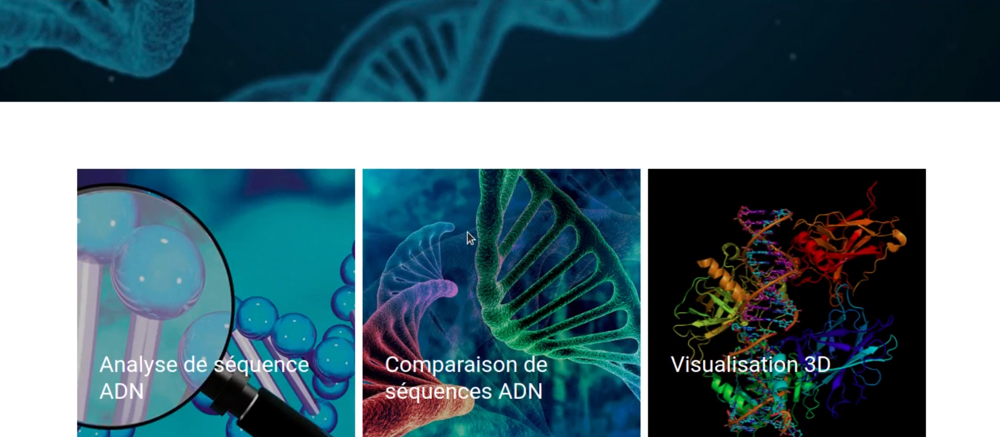

# DNA-sequencing
DNA sequencing web application

## How to run the web app
Install the requirements
```
python install -r requirements.txt
```
Access the `src` folder
```
cd src
```
Run the app
```
python manage.py runserver
```

## Login page


## Register page


## Homepage




## Profile page


## Analysis page 


## Comparison page


## 3D visualization page


